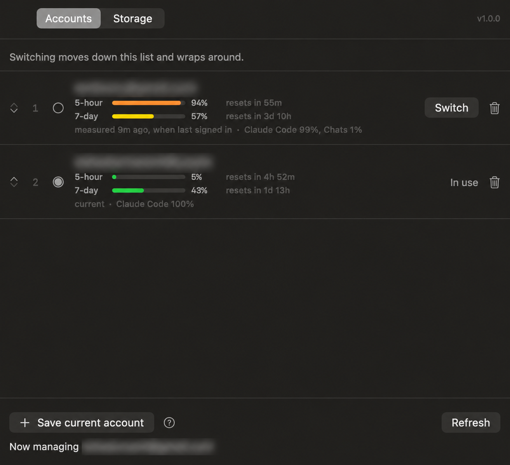

# Janus

A small macOS app for people who keep more than one Claude Code account, and who
have noticed how much disk the tools they use every day quietly hold onto.

[](https://github.com/RamitVishwakarma/Janus/actions/workflows/ci.yml)
[](https://github.com/RamitVishwakarma/Janus/releases/latest)
[](LICENSE)




It does two things:

- **Switches Claude Code accounts.** Signing in as another account normally means
  signing out first and typing the whole thing again. Janus saves each
  account's session and puts it back on demand, so the second account is one click
  away instead of one login away.
- **Clears developer caches.** A list of directories that are safe to delete,
  measured and shown with what each one costs to lose. Everything goes to the
  Trash rather than being deleted, so any decision can be taken back.

## Install

With Homebrew:

```sh
brew install --cask --no-quarantine ramitvishwakarma/tap/janus
```

Or download the latest `.dmg` from
[Releases](https://github.com/RamitVishwakarma/Janus/releases/latest), open it,
and drag Janus to Applications. The build is universal, covering Apple silicon
and Intel.

The app is signed ad-hoc rather than with a paid Apple Developer certificate, so
macOS quarantines it on first launch and says the developer cannot be verified.
`--no-quarantine` tells Homebrew to skip that flag. After a download by hand,
clear it once:

```sh
xattr -dr com.apple.quarantine /Applications/Janus.app
open /Applications/Janus.app
```

To have it start with the Mac, add it under System Settings → General → Login
Items, or:

```sh
osascript -e 'tell application "System Events" to make login item \
  at end with properties {path:"/Applications/Janus.app", hidden:true}'
```

### Build it yourself

Needs the Xcode Command Line Tools (`xcode-select --install`). Xcode itself is
not required.

```sh
git clone https://github.com/RamitVishwakarma/Janus.git
cd Janus
./build.sh
open Janus.app
```

## Using it

Janus cannot sign in for you, so the first account has to be signed in
already. Press **Save current account** and it is captured.

For the second: sign out of Claude Code, sign in as the other account, come back,
and press **Save current account** again. From then on both are in the list and
switching between them is one click, or `⌘S` from the menu bar.

The menu bar item shows which account is live. The window shows both accounts
with how much of their five-hour and weekly limits each has spent. That is the
number to look at when the decision you are making is *which account has room
left*.

## How switching works

A signed-in Claude Code session is two things on disk:

| Part | Where it lives |
| --- | --- |
| OAuth tokens | Keychain entry `Claude Code-credentials` |
| Everything else | `~/.claude.json` |

Switching is just moving that pair. Janus copies the live pair into storage
under the account it belongs to, then writes the other account's saved pair into
place. Saved tokens go into the login keychain under the service `Janus`;
saved settings go to `~/Library/Application Support/Janus/`, readable only
by you.

Three things follow from that, and are worth knowing before you trust it:

- **Nothing leaves the Mac.** There is no server, no telemetry, and no network
  code in this repository.
- **The settings file is written back whole.** It belongs to another program and
  gains keys between releases, so Janus parses what it needs and preserves
  everything else byte for byte.
- **Switching does not affect a running session.** Claude Code reads credentials
  at startup, so restart it to pick up the new account.

### If something goes wrong halfway

Every switch fetches the replacement session before it touches anything live, and
saves the session it is about to displace before overwriting it. If a step fails,
say a declined keychain prompt or a missing saved session, the Mac is left signed
into the account it was already signed into.

Signing in outside the app is handled too. If the live account is not one
Janus knows about, it is saved as a new account rather than overwritten,
because those credentials exist nowhere else.

## Clearing caches

The Storage tab measures a fixed list of cache directories: package managers,
build caches, browser and editor caches. Two rules keep it boring:

- **Nothing is deleted.** `FileManager.trashItem` moves things to the Trash.
- **Only caches inside your home directory can be touched.** Anything outside it
  is refused, as are the directories everything else lives inside, among them
  `~/Desktop`, `~/Library`, `~/.ssh` and `~/.claude`. This is enforced in code,
  not by being careful when editing the list, and there is a test asserting every
  entry in the catalogue passes it.

Caches belonging to a running app are shown greyed out with a **Quit it** link
rather than cleared underneath it. Clearing an editor's cache while the editor
holds files open in it is a good way to confuse the editor.

Some paths, `~/Downloads` and `~/.Trash` among them, are behind macOS privacy
controls. Grant Full Disk Access in System Settings → Privacy & Security if you
want them covered.

### Adding a cache to the list

Add an entry to `CacheEntry.developerTools` or `CacheEntry.applications` in
[`Sources/JanusCore/CacheCatalog.swift`](Sources/JanusCore/CacheCatalog.swift):

```swift
CacheEntry(id: "cargo", name: "Cargo registry",
           note: "Downloaded crate sources, refetched on the next build.",
           path: ".cargo/registry")
```

Paths are relative to the home directory. Entries that do not exist on a given
Mac are filtered out when scanning, so listing something niche costs nothing.

## Known limitations

- **Ad-hoc signed.** Every build produces a different signature, so macOS treats
  each new version as a new app and may ask for keychain permission again after
  an update. Signing with a self-signed certificate from Keychain Access gives a
  stable identity if that becomes annoying.
- **Not sandboxed.** The App Sandbox would cut the app off from the keychain entry
  and settings file it exists to move, which also means it cannot ship on the App
  Store.
- **macOS only.** Both halves of a session are stored in macOS-specific places.

## Development

```sh
swift build          # build
swift test           # run the tests (needs Xcode for XCTest)
./build.sh           # assemble Janus.app
```

The code is split so the interesting half can be tested without a window on
screen:

| Target | What is in it |
| --- | --- |
| `JanusCore` | Sessions, storage, the switch itself, the cache catalogue and its safety rules. No SwiftUI. |
| `Janus` | The SwiftUI window, the menu bar item, and the models behind them. |
| `JanusCoreTests` | Everything in `JanusCore`, against a temporary home directory and an in-memory keychain. |

`swift build` needs only the Command Line Tools; `swift test` needs XCTest, which
ships with Xcode. CI runs the tests on every push and pull request.

## Contributing

Issues and pull requests are welcome. See [CONTRIBUTING.md](CONTRIBUTING.md).
Security reports have their own route in [SECURITY.md](SECURITY.md).

## License

[MIT](LICENSE).

Janus is not affiliated with, endorsed by, or supported by Anthropic. It
reads and writes files and keychain entries belonging to Claude Code, which is a
product of Anthropic.
